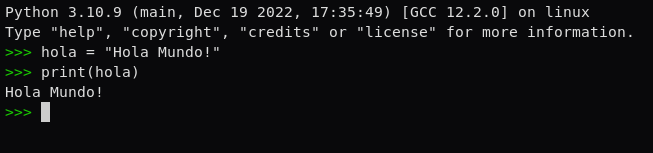

Desde la consola de python almacena la cadena “Hola mundo!” en una variable y muéstrala.

Tienes que subir capturas de pantalla en una carpeta comprimida zip.

> Cuando comiences el ejercicio se te mostrarán las especificaciones para la realización y
> entrega del mismo.
> La entrega del ejercicio deberá realizarse a través de una carpeta .zip empaquetada o un
> enlace al repositorio del ejercicio en GitHub.

Ejercicio:

