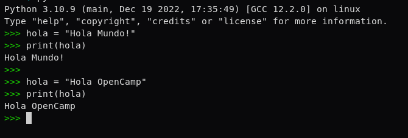

Modifica la variable del anterior ejercicio en la consola de python y
después muestrala por consola para ver la modificación de la variable.

Tienes que subir capturas de pantalla en una carpeta comprimida zip.

> Cuando comiences el ejercicio se te mostrarán las especificaciones para
> la realización y entrega del mismo. La entrega del ejercicio deberá 
> realizarse a través de una carpeta .zip empaquetada o un enlace al 
> repositorio del ejercicio en GitHub.

Ejercicio:

