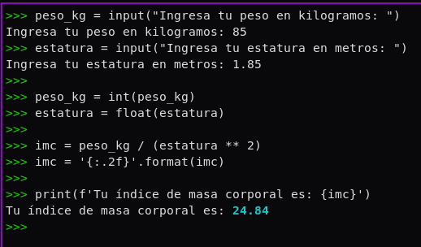

Escribe un programa en la consola de python que pida al usuario su peso (en kg)
y estatura (en metros), calcule el índice de masa corporal y lo almacene en una
variable, e imprima por pantalla la frase Tu índice de masa corporal es donde es
el índice de masa corporal calculado redondeado con dos decimales.

Ejercicio:



```py
$ python ejercicio3.py
Ingresa tu peso en kilogramos: 85
Ingresa tu estatura en metros: 1.85
Tu índice de masa corporal es: 24.84
```
